<h1 align="center">
    
</h1>

# Festo Wampamba
**`Software Engineer & Founder of kore-standards`**

I'm a Full-Stack Engineer and Content Creator building innovative solutions for the African tech ecosystem. All my projects, like **kore-standards**, are built from the ground up to solve real-life problems. I document this journey and teach DevOps, Networking, and Systems Administration on my YouTube channel, **Enterprise IT Mastery**.

       &nbsp;
       &nbsp;
       &nbsp;
       &nbsp;
   

---

## 👨‍💻 About Me
- 🎓 **Student at Makerere University Business School**
- 🛠️ **Lead Developer of [kore-standards](https://github.com/Festo-Wampamba/kore-standards):** Building innovative, industry-standard software solutions.
- 📺 **Enterprise IT Mastery:** I create content on DevOps, Networking, and System Administration.
- 💬 Ask me about **Next.js, PostgreSQL, Drizzle ORM, and RAG architectures.**
- 📫 Reach me at: **festotechug@gmail.com**

### 🤝 Connect with me

  
  
  
  

---

## 📂 Projects Showcase
<table>
  <tr>
    <td align="center" width="50%">
      
       
      <h3>kore-standards</h3>
      The core infrastructure project building industry-standard software solutions for Uganda and beyond. 
       
      
       
      Tags: Next.js, Postgres, AI
    </td>
    <td align="center" width="50%">
      
       
      <h3>📺 Enterprise IT Mastery</h3>
      My educational platform focusing on DevOps, Networking, and System Administration tutorials. 
       
      
       
      Tags: Education, DevOps, Content
    </td>
  </tr>
</table>

---

#

### 📺 Featured YouTube Videos

<!-- BEGIN YOUTUBE-CARDS -->
[")](https://www.youtube.com/watch?v=d04UUrTTXbc)
[")](https://www.youtube.com/watch?v=4-inSlGL2JY)
[: Building a CRUD App - Models, Migrations & Controllers")](https://www.youtube.com/watch?v=QRGaNvupBIc)
[: Folder Structure & Routing Explained!")](https://www.youtube.com/watch?v=kd5X3KiIDa4)
[")](https://www.youtube.com/watch?v=3rWZCgPHOyI)
[")](https://www.youtube.com/watch?v=bftGkPaGuQ8)
<!-- END YOUTUBE-CARDS -->

  

---

## 💻 Tech Stack

#### Languages
       

#### Frameworks & Libraries
    

#### Backend & API
  

#### Database & Storage
   

#### Hosting & Servers
    

#### OS & Tools
   

---

## 🧰 My Tool Box

<h3 align="left">Support:</h3>

# 📊 GitHub Stats:

| Stats | Streak |
| :---: | :---: |
|  |  |

  

---

## 📈 Contribution Graph

  

---

### ✍️  Festo's Random Quotes

  

---

###

 

###

 ### Show some ❤️ by starring some repositories!

  ## 💰 You can help me by Donating
   
  

